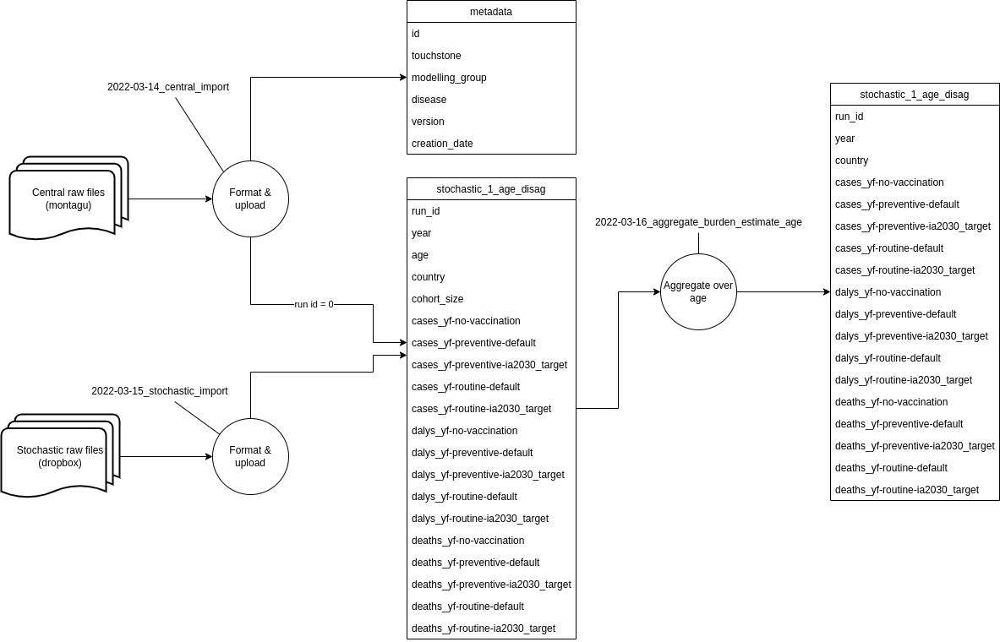

# db2-prototypes

Throw away repo containing scripts and benchmarks of data import and querying from VIMC 2.0 database. For testing we will import data for 2022110gavi-3 touchstone for YF with 3 countries AGO, BEN and BFA.

How can we expect this to scale with more touchstones, more diseases and more countries?

## Start DB

```
docker volume create pgdata
docker run --name experiment -p 5432:5432 -v pgdata:/var/lib/postgresql/data -v "${PWD}":/src -e POSTGRES_PASSWORD=password -d postgres
```

If you want to remove the data then remove the pgdata volume

## Imports

* 2022-03-14_central_import - contains script to pull centrals from montagu API and then script to add to format and import into the database
* 2022-03-15_stochastic_import - contains db import to upload stochastics from raw files into database. This transforms to a common pattern but does no aggregation
* 2022-03-24_measles_central_import - contains script to pull centrals from montagu API and then script to format and import into database
* 2022-03-24_measles_stochastic_import - contains db import to upload stochastics from raw files into database. Transforms to a common pattern but does no aggregation
* 2022-03-16_aggregate_burden_estimate_age - pulls age disaggregated data from database, aggregates over age and upload as `stochastic_n` tables


